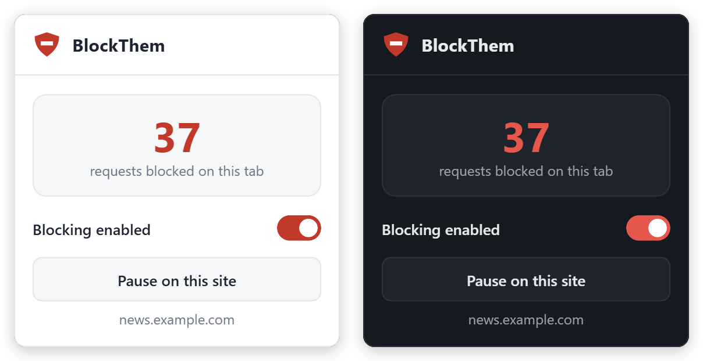
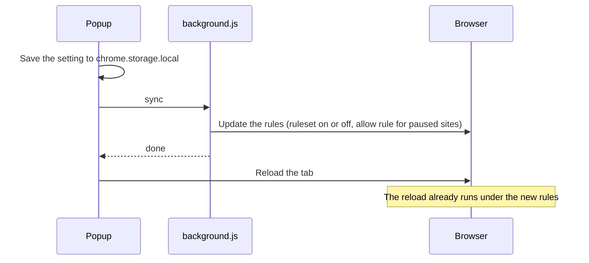

<p align="center">
  
</p>

<h1 align="center">BlockThem</h1>

<p align="center">
  <strong>Blocks ad and tracker networks, hides what they leave behind, and never phones home.</strong>
</p>

<p align="center">
  <a href="https://github.com/exosphere8/BlockThem/releases"></a>
  
  
  <a href="LICENSE"></a>
</p>

<p align="center">
  <a href="#install">Install</a> ·
  <a href="#usage">Usage</a> ·
  <a href="#privacy">Privacy</a> ·
  <a href="#how-it-works">How it works</a> ·
  <a href="#customize-the-blocklist">Customize</a> ·
  <a href="#contributing">Contributing</a>
</p>

<p align="center">
  
</p>

BlockThem is a small Manifest V3 extension for Chromium browsers. It gives a hand-picked list of 56 ad and tracker domains to the browser's built-in blocking engine, then hides the empty ad boxes left on the page. One popup, two controls, no settings page, no dependencies, no build step.

## Features

- **Network blocking.** The browser's built-in `declarativeNetRequest` engine stops requests to Google Ads and DoubleClick, Google Analytics, Amazon Ads, Criteo, Taboola, Outbrain, Hotjar, Bing and LinkedIn ad endpoints, and more. Subdomains are included.
- **Cosmetic cleanup.** A stylesheet hides the boxes ads leave behind: AdSense units, Google Publisher Tag slots, AMP ads, Taboola and Outbrain widgets, and common `.ad-*` containers.
- **Live counter.** The toolbar badge shows how many requests were blocked on the current tab.
- **Pause per site.** One click turns BlockThem off for the site you're on, including the frames inside its pages. One switch turns it off everywhere.
- **Blocks the embed, not the vendor.** The 52 ad-network domains are blocked only when *another* site loads them, so a vendor's own site, like `insights.hotjar.com`, can still load files from `hotjar.com`. Pages you open directly are never blocked.
- **Private.** No accounts, no telemetry, no remote code, and no network requests of its own.

## Install

1. Download the `.zip` from the **[latest release](https://github.com/exosphere8/BlockThem/releases/latest)** and unzip it into a folder you'll keep. The browser runs BlockThem from that folder.
2. Open `chrome://extensions` (Edge: `edge://extensions`, Brave: `brave://extensions`).
3. Turn on **Developer mode**.
4. Click **Load unpacked** and select the folder that contains `manifest.json`.
5. Pin BlockThem from the puzzle-piece menu so the shield stays in your toolbar.

<details>
<summary><strong>Install from source instead</strong></summary>

```bash
git clone https://github.com/exosphere8/BlockThem.git
```

Then follow steps 2–5 and select the cloned `BlockThem` folder.

</details>

> [!NOTE]
> **Updating:** replace the folder's contents with the new version, then click the reload arrow on BlockThem's card in `chrome://extensions`. Keep the same folder and your settings carry over.

## Usage

Click the shield in your toolbar.

| Control | What it does |
| --- | --- |
| **The number** | Requests blocked on this tab. The toolbar badge shows the same count. |
| **Blocking enabled** | Turns BlockThem on or off everywhere. |
| **Pause on this site** | Turns BlockThem off for this hostname (for example `news.example.com`) and its subdomains. The button then reads **Resume blocking on this site**. |

Every change is applied before the page reloads, so the page always matches the setting. On a subdomain of a site you paused, the popup names the entry that covers it, and **Resume** lifts it.

> [!TIP]
> If a site misbehaves (a button that does nothing, a checkout that won't continue), pause BlockThem on that site.

## Privacy

BlockThem collects nothing. It doesn't phone home, track usage, or load code from anywhere. Your two settings, the on/off switch and your list of paused sites, stay in `chrome.storage.local` on your device.

| Permission | Why it's needed |
| --- | --- |
| `declarativeNetRequest` | Hands the blocklist to the browser, which matches requests itself. BlockThem never sees your traffic. It only gets the per-tab count shown on the badge. |
| `storage` | Remembers the on/off switch and your paused sites, locally. |
| `activeTab` | Lets the popup see the tab you're on when you click the shield, so it knows which site to pause. |
| Access to all sites | Lets BlockThem add the stylesheet that hides leftover ad boxes on every page. Chrome lists this as *"Read and change all your data on all websites."* The script reads only addresses (the page's own and its parent frames') to check your paused list. It never reads or sends page content. |

## How it works

Two layers: the browser blocks requests to listed domains, and a stylesheet hides what's left. Both use the same definition of "paused": a hostname, its subdomains, and everything loaded inside its frames.

| File | Role |
| --- | --- |
| `manifest.json` | Declares the permissions, the static `ads` ruleset, the content script, and the popup. |
| `rules.json` | The blocklist. **Rule 1** lists 52 ad and tracker domains, blocked when other sites load them. **Rule 2** lists 4 ad and tracking subdomains of big platforms (`adservice.google.com`, `ads.linkedin.com`, `bat.bing.com`, `ads.yahoo.com`), blocked everywhere. Top-level page loads are never blocked. |
| `background.js` | Turns the ruleset on or off and keeps one high-priority "allow everything" rule for paused sites. Updates run one at a time. |
| `content.js` | Injects the hiding stylesheet, unless blocking is off or this frame or any frame above it is on a paused site. |
| `popup.html` · `popup.js` | The toolbar popup. |

**When you change a setting**, the steps always run in this order, so the reload never races the rule update:



## Customize the blocklist

Everything lives in [`rules.json`](rules.json). Subdomains are matched automatically, so `doubleclick.net` also covers `ad.doubleclick.net`.

- **An ad or tracking company's domain** → add it to `requestDomains` in **rule 1**. It's blocked whenever another site loads it, and the company's own site can still load it.
- **An ad subdomain of a site people use directly** (like `ads.linkedin.com`) → add it to **rule 2**. Rule 1 wouldn't catch it on its parent site, because there it counts as first-party.
- **Another kind of leftover ad box** → add a CSS selector to `SELECTORS` in [`content.js`](content.js).

Then click the reload arrow on BlockThem's card in `chrome://extensions`.

## Limitations

- **Same-domain ads aren't blocked.** YouTube video ads and Facebook sponsored posts come from the site's own servers. Blocking them needs site-specific scripting, which BlockThem doesn't do.
- **The list is small and hand-picked**, not a large community filter list. For the most coverage, use a filter-list blocker such as [uBlock Origin Lite](https://github.com/uBlockOrigin/uBOL-home).
- **Changes reload only the current tab.** Other open tabs fully pick up the new setting the next time they load.

## Behind the scenes

Before v1.0.0 shipped, I reviewed it for API correctness, user-facing behavior and filter quality, and every finding had to survive a rebuttal before it got fixed. Four bugs made it through; six reports didn't. Each one has a write-up:

- [Saved is not applied](https://github.com/exosphere8/postmortems/blob/main/saved-is-not-applied.md): a "paused" page that wasn't actually paused.
- [Two definitions of "this site"](https://github.com/exosphere8/postmortems/blob/main/two-definitions-of-this-site.md): why Resume could get stuck on a subdomain.
- [The catch block that always caught](https://github.com/exosphere8/postmortems/blob/main/the-catch-that-always-caught.md): a fallback that quietly became the whole program.
- [I blocked Hotjar on hotjar.com](https://github.com/exosphere8/postmortems/blob/main/i-blocked-hotjar-on-hotjar.md): a blocklist entry is a claim about context.
- [Six of my ten bug reports were wrong](https://github.com/exosphere8/postmortems/blob/main/six-of-ten-bug-reports-were-wrong.md): what the rejected findings taught me about reviewing.

## Contributing

Issues and pull requests are welcome. If a site breaks while BlockThem is on, open an issue with the address and what stopped working.

**To add a domain:**

1. Add it to rule 1 or rule 2 in `rules.json` (see [Customize](#customize-the-blocklist)).
2. Reload the extension, visit a page that uses the domain, and check that the counter goes up and the page still works.
3. Open a PR that names the domain, what it serves, and a page where you saw it. If you'd rather not edit the file yourself, open an issue with the same details.

Please keep code changes free of dependencies and build steps.

## License

[MIT](LICENSE)
